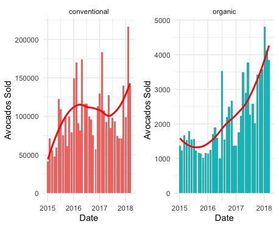

# :avocado: Avocado Prices: Analyzing Seasonality and Pattern Trends :avocado:
Data dive into avocado sales trends
*From the Hass Avocado Board website*

The table below represents weekly 2018 retail scan data for National retail volume (units) and price. Retail scan data comes directly from retailers’ cash registers based on actual retail sales of Hass avocados. Starting in 2013, the table below reflects an expanded, multi-outlet retail data set. Multi-outlet reporting includes an aggregation of the following channels: grocery, mass, club, drug, dollar and military. The Average Price (of avocados) in the table reflects a per unit (per avocado) cost, even when multiple units (avocados) are sold in bags. The Product Lookup codes (PLU’s) in the table are only for Hass avocados. Other varieties of avocados (e.g. greenskins) are not included in this table.

## Data Exploration 
### Data Clean-Up 
Upon first glance, we see that the region column has 3 distinct location types: Region, State, City/Area. It's impossible to understand exactly how state and city/area overlap with Region, so I will just analyze each location type seperately to avoid overlap. We have data from all of 2015-2017, but only until March 2018. This will be a great opportunity to forecast for the rest of the year.

The first column in the dataset is just a count of the observations so I will eliminate it.
```
avo<-avo[-1]
```

Additionally, 3 columns are named by avocado PLU, which is difficult to understand and read. So I will rename these columns to match the avocado type.  
```
avo$smallHass<-avo$X4046
avo$largeHass<-avo$X4225
avo$xlHass<-avo$X4770
avo<-avo[-(4:6)] #remove old column names
```
So we are left with a dataset with **18,249 observations and 13 columns!**

Lets format the date column correctly and put it into ascending order. This will make subsetting the data easier later.

```
avo$Date <- as.Date(avo$Date, "%Y-%m-%d")
avo<-avo[order(as.Date(avo$Date, format="%Y-%m-%d")),]
```
### Exploration
We see that this dataset includes two types of avocados. 

**I'm hoping to understand how conventional and organic avocados differ in price and volume of sales, and also how seasonality & supply affects price and sales.**
```
levels(avo$type)
[1] "conventional" "organic"  
```

Upon first glance, we see conventional avocados accounting for 97.2% of sales, while organic avocados account for only 2.8%

| Type         | Average Volume | Percent       |     
|--------------|----------------|---------------|
| Conventional | 1,653,213      | 97.2%         |  
| organic      | 47,811         | 2.81%         |  
                                           


We can conclude that organic avocados are way more expensive than conventional avocados. Average price of organic avocados is **35% higher**.

| Type         | Average Price  | 
|--------------|----------------|
| Conventional | $1.16          | 
| organic      | $1.65          | 


 


We see average price has fluctuated dramatically over the last 3 years. However it's important to observe the avocado prices are rising continuously over time, probably due to increasing demand. For conventional avocadods average price fluctuated the most in 2017, with average prices dipping below .$50 early in the year, but peaking above $1.70 towards the end of the year.

**Conventional Avocados:** Conventional Avocado sales continuously rose from 2015-2016, but took a significant dip in mid-2017. Avocado supply was famously limited in 2017, which would explain why fewer avocados were sold.

**Organic Avocados:** Organic avocado sales continuously rose for the full time span, and are approaching an exponential curve. I believe these rising sales occur for two reasons: 

1. Greater demand for organic avocados as farming and access to organic agriculture grows worldwide. 
2. Rising population

### Regional patterns
We have 7 different regions in our data, giving us a great insight as to how demand and price differs across regions of the US 
```
c("West","SouthCentral", "Northeast", "Southeast", "Midsouth", "Plains", "GreatLakes")
```

#### Visualizations 


#### Summary
- We can quickly observe that organic avocado supply and sales are dramatically lower than conventional sales, but price is only slightly higher.
- West and South Central lead the way in volume for both conventional and organic avocados, while Plains and Mid-South are clearly at the bottom. This probably has to do with proximity to Mexico, and the specific regions in which avocados grow.
- West and South Central overall have the lowest priced avocados, probably due to their inceased supply on the west coast. Los Angeles shows the largest supply of both conventional and organic avocados. Contrary to this, San Francisco has the highest priced conventional and organic avocados, due to having a high cost of living.
- Avocados are popular everywhere, but much more popular on the west coast. 


### Analyzing Seasonal Patterns:
In this section, I want to try and detect any reoccuring seasonality patterns. Are there any easily identifiable repeating trends? 

**We can easily observe that starting in May, avocado prices increase dramatically, but why?**
- American avocados take no longer than eight months to move from blooms to harvest. The blooming season begins in February or March, so mature avocados are ready for picking between May and September.
- In the summer months, demand rises for avocados as people consume more

**Supply and demand tend to have an inverse relationship, and as supply rises in the summer we can expect to see increased prices. How can we explain a rise in price if supply and demand are both rising at the same time?**

- The answer to that question (according to a 2017 npr article), is that in 2017 California and Mexico experienced an intense heatwave in summer 2017 which wiped out a significant percentage of avocado crops!


## Forecast

ARIMA forecasting is short for 'Auto Regressive Integrated Moving Average'.It's a model that 'explains' a given time series based on its own past values (lags), so that equation can be used to forecast future values. 
#### Conventional Avocados
- We can observe that 2018-2020 will continue to show seasonality trends.
- Conventional avocado prices will most likely continue to rise in the near future as demand grows higher
- 2020 shows potential for a significant drop in the price of conventional avocados, possibly reaching an all time low.
- I would predict another rises in prices after a low in 2020


#### Organic Avocados
- We can observe that 2018-2020 will continue to show seasonality trends.
- Organic avocado prices will most likely continue to rise in the near future as demand grows higher
- Interestingly, we see organic avocados forecasting a significant drop in price, with little fluctuation in price.
- Organic avocados possibly will drop below $1 in 2020


## Conclusion:
We can observe several important results from our analysis of this dataset:

**Organic Avocados Are Expensive:** As expected, we have noticed that organic avocados are much more expensive than conventional avocados. Most patterns are similar between the two types of avocados.

**Year 2017:** 2017 was the most volatile year for avocados, but a good year to be selling avocados on account of the shortage. The extreme heatwaves in the summer of 2017, contributed to a shortage of avocados, and the supply tanked. Demand quickly rose during the summer, and prices surged to all time highs.

**Buy avocados before fall!:** Avocado prices are clearly highest during the fall, and lowest in the winter. I believe this is due to the high consumpiton of avocados in the summer, and the supply dropping continously as a result.

**Downward trend in the longrun:** Based on our ARIMA model, we expect avocados to rise in price for a couple years, and then move to a downard trend shortly after 2020.

